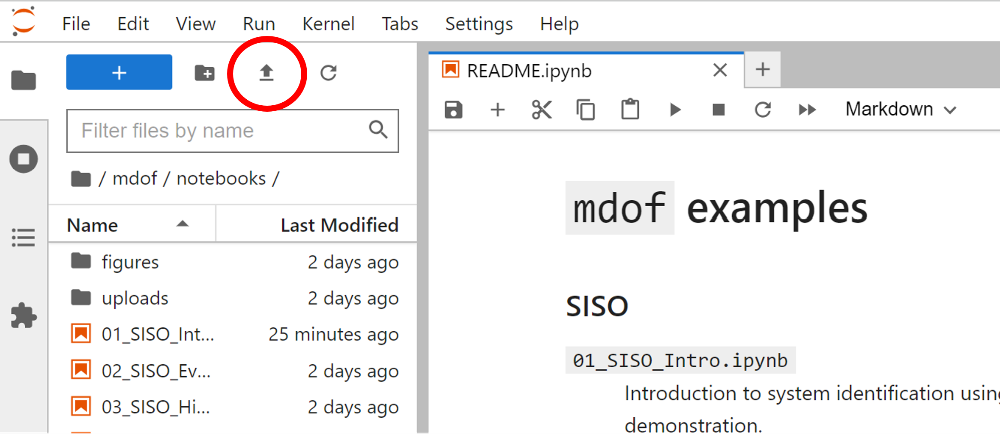

::: {#6cadac5c-e505-431c-9740-9268e17d2cf3 .cell .markdown tags="[]"}
# BRACE2 Structural System Identification Library (`ssid`)
:::

::: {#4c369c63 .cell .markdown}
```{=html}
<h3 id="siso">SISO</h3>
```
```{=html}
<dl>
<dt><a href="01_SISO_Intro.ipynb"><code>01_SISO_Intro.ipynb</code></a></dt>
<dd><p>Introduction to system identification using the <code>ssid</code> package, with an example SDOF system, input, and output as a demonstration.</p>
</dd>
<dt><a href="02_SISO_Event.ipynb"><code>02_SISO_Event.ipynb</code></a></dt>
<dd><p>Perform system identification for a single event for a Single Input, Single Output (SISO) system.</p>
</dd>
<dt><a href="03_SISO_History.ipynb"><code>03_SISO_History.ipynb</code></a></dt>
<dd><p>Perform system identification for a set of events over time for a SISO system.</p>
</dd>
</dl>
```
```{=html}
<h3 id="mimo">MIMO (Under development)</h3>
```
```{=html}
<dl>
<dt><a href="04_SIMO_Event.ipynb"><code>04_SIMO_Event.ipynb</code></a></dt>
<dd><p>Perform system identification for a single event for a MIMO system.</p>
</dd>
<dt><a href="05_MIMO_Intro.ipynb"><code>05_MIMO_Intro.ipynb</code></a></dt>
<dd><p>Introduction to Multiple Input, Multiple Output (MIMO) system identification using the <code>ssid</code> package.</p>
</dd>
<dt><a href="06_MIMO_History.ipynb"><code>06_MIMO_History.ipynb</code></a></dt>
<dd><p>Perform system identification for a set of events over time for a MIMO system.</p>
</dd>
</dl>
```
:::

::: {#a089497e .cell .markdown}
Run the following cell to install the BRACE2 packages:
:::

::: {#cff7d6c5 .cell .code vscode="{\"languageId\":\"plaintext\"}"}
``` python
!pip install -Ur requirements.txt
```
:::

::: {#b2fd8aa9 .cell .markdown}
### Getting Started
:::

::: {#fafa29bc .cell .markdown}
To upload:



To run:


:::
