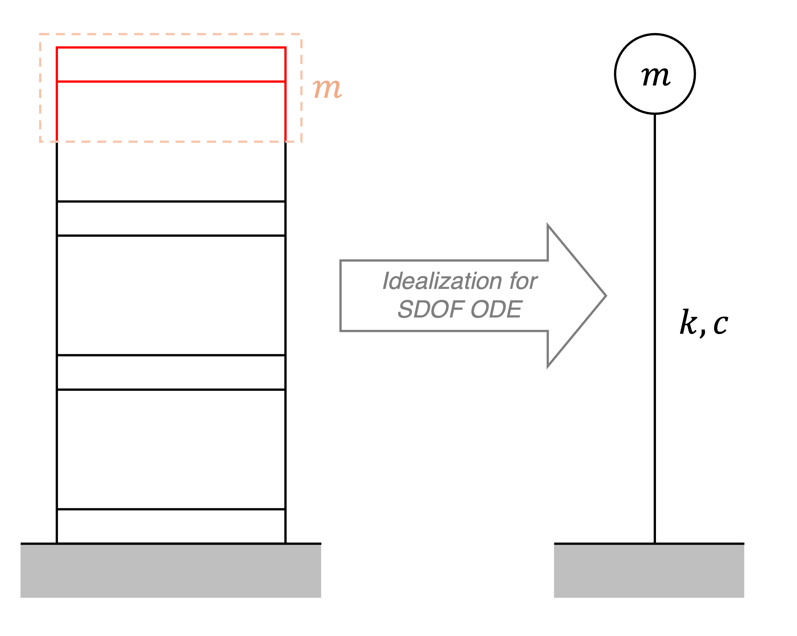

# (6) Stiffness of each type of steel

Remember the relations, $\omega_{n} = \sqrt{\frac{k}{m}}$ and $T_{n} = \frac{2\pi}{\omega_{n}}$. Note that $T_{n}$ is the natural period.

1. Derive the relation $\omega_{n} = \sqrt{\frac{k}{m}}$ from the governing differential equation of motion for a single degree of freedom (undamped) harmonic oscillator in free vibration, $m\ddot{u} + ku = 0$.

2. Use the relations above, along with the mass of the model materials, to determine the stiffness of each model. Assume the mass is "lumped" at the top floor, and equal to the mass of one polycarbonate block with sensor attached plus a half story of steel wall. Note: the units of stiffness should be a unit of force per unit displacement, such as kg/cm.

Write your answers below, or in a separate document.

1. If $m\ddot{u} + ku = 0$, then $u(t) = c_{1}\cos{\omega_{n} t} +  c_{2}\sin{\omega_{n} t}$.

How do we solve for $\omega_{n}$ in terms of the values of $m$ and $k$?

**[SOLUTION, OPTION A]**:

Using the general method for solving a second-order, linear, constant-coefficient ODE:
- Form the characteristic polynomial: $mr^{2} + kr = 0$.
- Solve the quadratic equation for $r$: $r = \pm \frac{\sqrt{-4mk}}{2m}$
- Simplify: $r = \pm i\sqrt{\frac{k}{m}}$
- There are two complex roots, $\alpha + i\beta$, which means that the solution is of the form $u(t) = c_{1}e^{\alpha t}\cos{\beta t} + c_{2}e^{\alpha t}\sin{\beta t}$.
- Therefore, $\boxed{\omega_{n} = \beta = \sqrt{\frac{k}{m}}}$.
- (P.S. note that $\alpha=0$, so $e^{\alpha t}=1$ and that term disappears from the solution.)

**[SOLUTION, OPTION B]**:

Since the solution, $u(t)$, of the differential equation is given, we can take its derivative and plug it back into the ODE:
- ODE solution (zeroth derivative): $u(t) = c_{1}\cos{\omega_{n} t} +  c_{2}\sin{\omega_{n} t}$
- First derivative: $\dot{u}(t) = -\omega_{n}c_{1}\sin{\omega_{n} t} + \omega_{n}c_{2}\cos{\omega_{n} t}$
- Second derivative: $\ddot{u}(t) = -\omega_{n}^{2}c_{1}\cos{\omega_{n} t} - \omega_{n}^{2}c_{2}\sin{\omega_{n} t}$
- Plug back into ODE: $-m\omega_{n}^{2}c_{1}\cos{\omega_{n} t} - m\omega_{n}^{2}c_{2}\sin{\omega_{n} t} + kc_{1}\cos{\omega_{n} t} +  kc_{2}\sin{\omega_{n} t} = 0$
- Rearrange: ${(k-m\omega_{n}^{2})}$$(c_{1}\cos{\omega_{n} t}+c_{2}\sin{\omega_{n} t})=0$
- The term, $(c_{1}\cos{\omega_{n}t}+c_{2}\sin{\omega_{n}t})$, can never be zero for all time $t$ ($\cos{\omega_{n}t}$ and $\sin{\omega_{n}t}$ are *"independent"*). So, the above equation holds true for all time $t$ if and only if $(k-m\omega_{n}^{2}) = 0$.
- Rearranging, $\boxed{\omega_{n} = \sqrt{\frac{k}{m}}}$.

2. Start by calculating the "lumped mass."

$m$ = (mass of 1 polycarb block with sensor attached) + 0.5(mass of 6 inches (1 floor) of 2 steel walls).

Then compute $k$ from the relations $\omega_{n} = \sqrt{\frac{k}{m}}$ and $T_{n} = \frac{2\pi}{\omega_{n}}$.

**[SOLUTION]**:

First, calculate the lumped mass.
- Mass of the block with sensor attached = $0.124{\text{kg}}$.
- 3 Story Stiff model:
    - Weight of steel per unit length: $(0.8245{\text{kg}}-4(0.124{\text{kg}}))/(2(18{\text{in}})) = 0.00913{\text{kg/in}}$
    - Lumped weight: $w_{\text{3st}} = 0.124{\text{kg}} + 0.5((6\text{in})(2)(0.00913\text{kg/in})) = 0.179\text{kg}$
- 1 Story Stiff model:
    - Weight of steel per unit length: $(0.3589{\text{kg}}-2(0.124{\text{kg}}))/(2(6{\text{in}})) = 0.00924{\text{kg/in}}$
    - Lumped weight: $w_{\text{1st}} = 0.124{\text{kg}} + 0.5((6\text{in})(2)(0.00924\text{kg/in})) = 0.179\text{kg}$
- Flexible model:
    - Weight of steel per unit length: $(0.6045{\text{kg}}-4(0.124{\text{kg}}))/(2(18{\text{in}})) = 0.00301{\text{kg/in}}$
    - Lumped weight: $w_{\text{3fl}} = 0.1240{\text{g}} + 0.5((6\text{in})(2)(0.00301\text{g/in})) = 0.142\text{kg}$

Then compute $k$.
- Rearranging the two equations, $k = m(\frac{2\pi}{T})^2$.
- 3 Story Stiff Steel Stiffness: $k_{\text{3st}} = 0.179\text{kg}*\frac{1}{981 \text{cm}/\text{s}^2}(\frac{2\pi}{0.127\text{s}})^2 = \boxed{0.44 \text{kg/cm}}$
- 1 Story Stiff Steel Stiffness: $k_{\text{1st}} = 0.179\text{kg}*\frac{1}{981 \text{cm}/\text{s}^2}(\frac{2\pi}{0.050\text{s}})^2 = \boxed{2.87 \text{kg/cm}}$
- 3 Story Flexible Steel Stiffness: $k_{\text{3fl}} = 0.142\text{kg}*\frac{1}{981 \text{cm}/\text{s}^2}(\frac{2\pi}{0.274\text{s}})^2 = \boxed{0.08 \text{kg/cm}}$

**Note**: due to rounding, the stiffnesses may be off by up to 0.01 kg/cm.